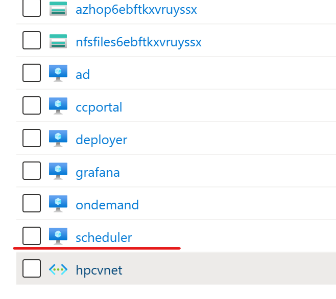
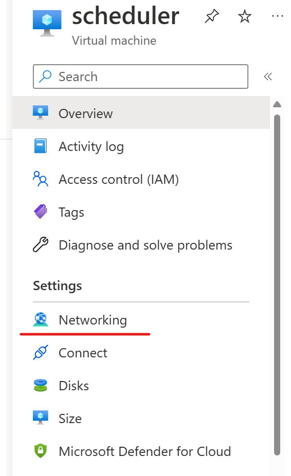
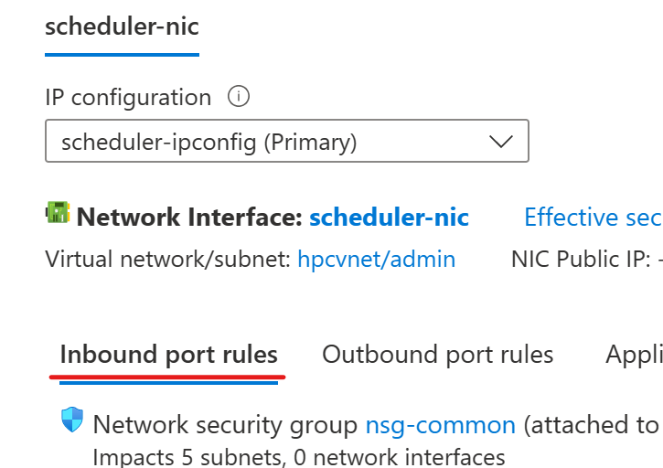
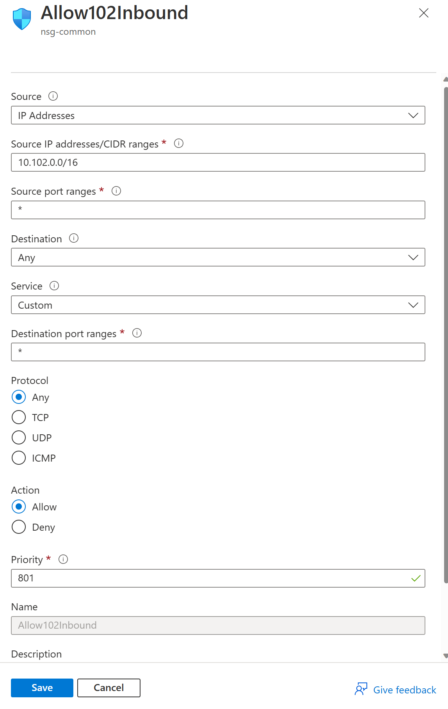
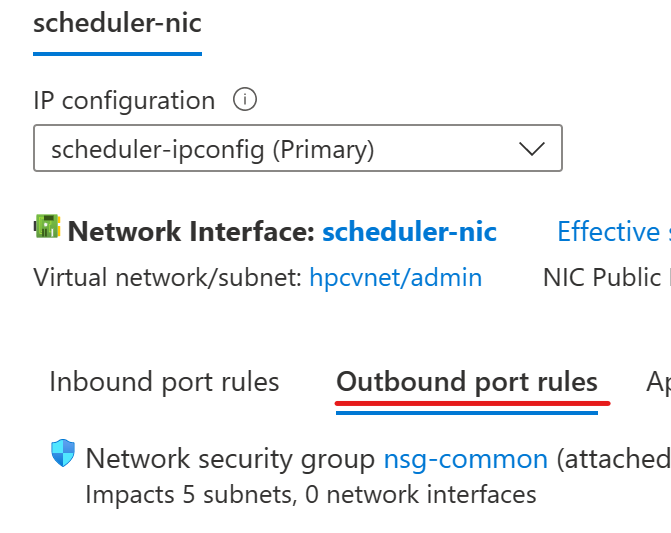
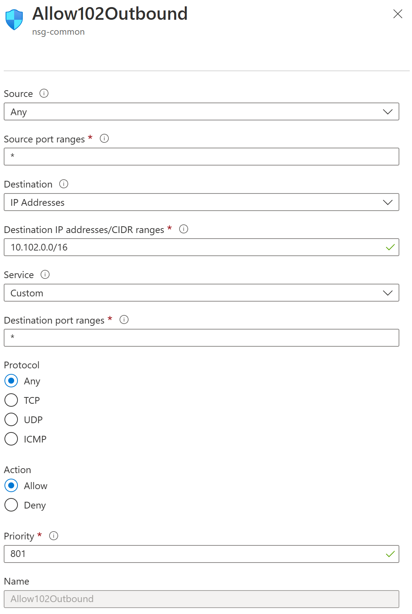

This post is to demonstrate how to setup SLURM federation between an on-prem cluster and an Azure cluster. Both clusters will be deployed by [azhop](https://azure.github.io/az-hop/). Please refer to the azhop documentation on how to deploy an HPC environment on Azure. 

## About SLURM federation
Slurm Federation is a feature of the Slurm Workload Manager, a highly scalable and flexible open-source cluster management and job scheduling system commonly used in high-performance computing (HPC) environments.

A Slurm Federation allows multiple independent clusters to be connected and managed as a single entity. This enables users to submit jobs to the federation as a whole, rather than to a specific cluster. The jobs are then automatically routed to the appropriate cluster for execution, based on the available resources and the job requirements. This can help to improve the utilization of resources across multiple clusters, increase the efficiency of job scheduling, and provide a more seamless user experience.

In a Slurm Federation, each participating cluster is considered a member of the federation and operates as a separate entity. The members communicate with each other using the Slurm messaging layer, and a centralized management entity is responsible for coordinating the scheduling and execution of jobs across the federation.

Slurm Federation is a relatively new feature, and its implementation and use can be complex. However, it has the potential to greatly enhance the capabilities of HPC systems and support the efficient use of resources in large-scale computing environments.

## Add scheduler node network security group (NSG) rules and setup virtual network peering
To setup SLURM federation we need to enable slurmdbd communications between on-prem and cloud clusters. New NSG rules and vnet peering need to be added to enable the commnucation. 

First go to the scheduler node which hosts the slurmdbd and add inbound/outbound rules. This needs to be done from both on-prem and cloud scheduler nodes.







Then add vnet peering from either the on-prem or the cloud end. The other end will be created automatically. 


## Sync the munge key
Copy the on-prem munge key from `/etc/munge/munge.key`
```bash
[root@scheduler ~]# cat /etc/munge/munge.key
```
Paste and replace the munge key to the cloud cluster in two locations. 
```bash
[root@scheduler ~]# ls /etc/munge/munge.key /sched/munge/munge.key
/etc/munge/munge.key  /sched/munge/munge.key
```
The first munge.key is local to the scheduler node, and the second munge key is used to populate to the compute nodes. 

Once the munge key is replaced on the cloud cluster, restart the munge daemon. 
```bash
[root@scheduler ~]# systemctl restart munge.service 
[root@scheduler ~]# systemctl status munge.service
● munge.service - MUNGE authentication service
   Loaded: loaded (/usr/lib/systemd/system/munge.service; enabled; vendor preset: disabled)
   Active: active (running) since Thu 2023-02-09 21:05:50 UTC; 7s ago
     Docs: man:munged(8)
  Process: 14428 ExecStart=/usr/sbin/munged (code=exited, status=0/SUCCESS)
 Main PID: 14430 (munged)
    Tasks: 4
   Memory: 516.0K
   CGroup: /system.slice/munge.service
           └─14430 /usr/sbin/munged

Feb 09 21:05:50 scheduler systemd[1]: Starting MUNGE authentication service...
Feb 09 21:05:50 scheduler systemd[1]: Started MUNGE authentication service. 
```

## Rename the SLURM cluster if desired
SLURM cluster name is defined in the `/etc/slurm/slurm.conf` file
```bash
[root@scheduler ~]# vim /etc/slurm/slurm.conf
```
Change the line below
```bash
ClusterName=cloud
```
Delete the cached cluster name and restart SLURM controller daemon
```bash
rm /var/spool/slurmd/clustername
```
```bash
[root@scheduler ~]# systemctl restart slurmctld.service 
[root@scheduler ~]# systemctl status slurmctld.service
● slurmctld.service - Slurm controller daemon
   Loaded: loaded (/usr/lib/systemd/system/slurmctld.service; enabled; vendor preset: disabled)
   Active: active (running) since Thu 2023-02-09 21:11:22 UTC; 5s ago
 Main PID: 15833 (slurmctld)
    Tasks: 5
   Memory: 2.8M
   CGroup: /system.slice/slurmctld.service
           └─15833 /usr/sbin/slurmctld -D

Feb 09 21:11:22 scheduler systemd[1]: Started Slurm controller daemon.
```

## Point the cloud cluster to use on-prem slurmdbd
The slurmdbd host IP is configured in the `/etc/slurm/slurm.conf` file.


